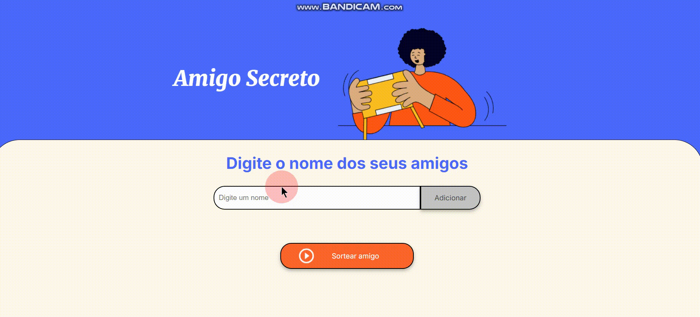

## Curso de Lógica de Programação Alura

# Sorte do Amigo Secreto 🎁

O jogo será baseado em um jogo de amigo secreto, onde será digitado o nome e o próprio sistema irá escolher o amigo retirado.

---

## Como Usar 🚀

### 1 - **Adicionar Nomes:**

- Digite o nome no campo de texto.
- Clique em **"Adicionar Amigo"**.
- O nome aparecerá na lista abaixo.

### 2 - **Sortear Amigo:**

- Adicione pelo menos dois nomes.
- Clique em **"Sortear Amigo"**.
- O nome sorteado será exibido na tela.

---

## Tecnologias Utilizadas 💻

- **HTML**: Estrutura da página.
- **CSS**: Estilo básico.
- **JavaScript**: Lógica do sorteio.

---

## Criado por Luiz Gomes

🔗 [GitHub](https://github.com/LuizCarlosGomesJr)

